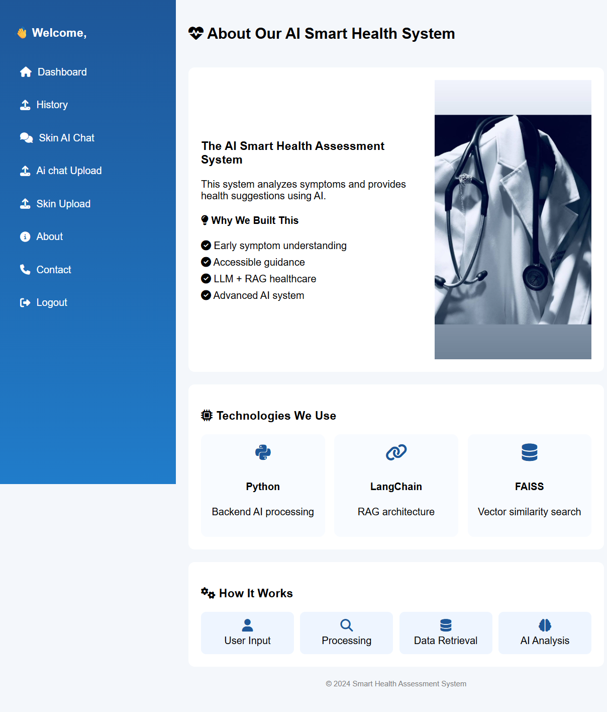
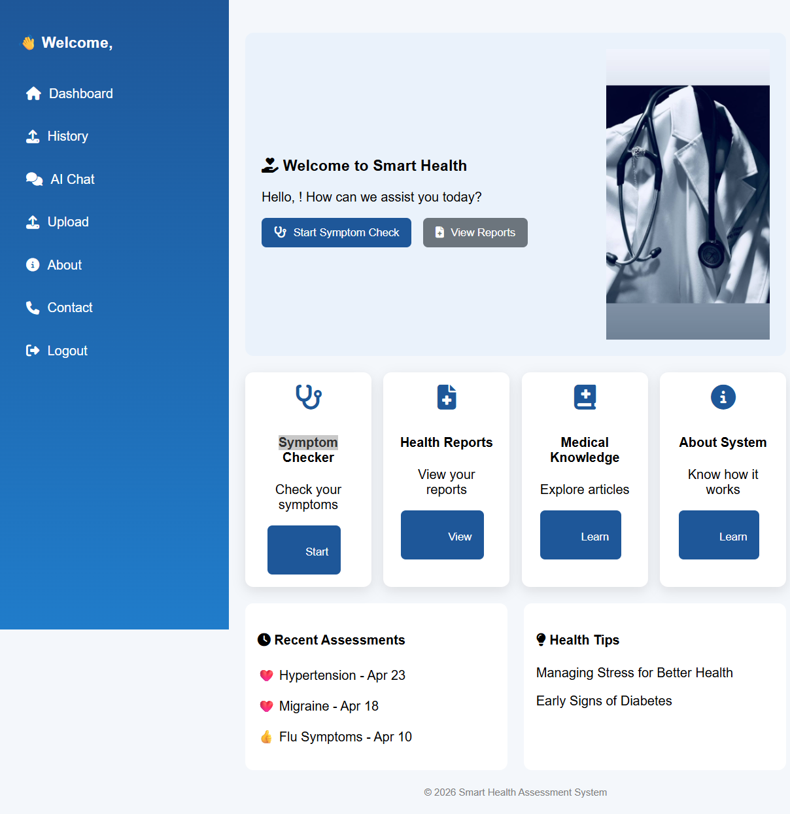

# Agentic-AI-using-LLM-for-Intelligent-Health-Assessment
🤖 Agentic AI using LLM for Intelligent Health Assessment
📌 Project Description

This project is an Agentic AI-based Intelligent Healthcare Assistant developed using Google Gemini LLM and Retrieval-Augmented Generation (RAG) architecture.

The system is designed to provide intelligent, context-aware and accurate healthcare assistance by integrating:

Retrieval-Augmented Generation (RAG)
Google Gemini Large Language Model (LLM)
FAISS Vector Database
Sentence Transformer Embeddings
OCR-based Text Extraction
Skin Disease Prediction

Unlike traditional RAG systems that follow a simple Retrieve → Answer workflow, the proposed system introduces an advanced Think → Retrieve → Act → Reason → Answer pipeline for enhanced reasoning and contextual understanding.

The system can analyze medical queries, retrieve relevant information from medical PDF datasets, perform semantic reasoning, and generate meaningful healthcare responses.

🎯 Objective of the Project

The main objective of this project is to develop an intelligent AI-powered healthcare assistant capable of:

Understanding complex medical queries
Performing semantic search using vector embeddings
Providing accurate and context-aware healthcare responses
Improving reasoning capability using Agentic AI workflow
Supporting OCR-based document analysis
Integrating skin disease prediction with high accuracy
Enhancing healthcare decision support systems
🛠 Tools and Technologies Used
Technology	Purpose
Python	Core Programming Language
Flask	Backend Web Framework
LangChain	RAG Pipeline & LLM Orchestration
Google Gemini	Large Language Model
FAISS	Vector Database for Semantic Retrieval
Sentence Transformers	Text Embedding Generation
OCR	Text Extraction from Images/PDFs
TensorFlow / Keras	Skin Disease Prediction Model
DenseNet121	Deep Feature Extraction
Genetic Algorithm	Feature Optimization
DNN	Disease Classification
HTML, CSS, JavaScript	Frontend Development
Git & GitHub	Version Control

🚀 Key Features

✅ Intelligent healthcare question answering

✅ Agentic AI workflow implementation

✅ Think → Retrieve → Act → Reason → Answer pipeline

✅ Semantic medical document retrieval

✅ PDF-based medical question answering

✅ OCR-based text extraction support

✅ Voice interaction support

✅ Skin disease prediction module

✅ Context-aware healthcare response generation

✅ FAISS vector similarity search

✅ Gemini-powered reasoning and response generation

✅ User-friendly healthcare interface

🧠 Proposed Agentic AI Workflow

The proposed system follows a structured multi-stage reasoning pipeline:

User Query
     ↓
Think
(Analyze query intent)
     ↓
Retrieve
(Fetch relevant medical information)
     ↓
Act
(Determine processing strategy)
     ↓
Reason
(Perform logical inference)
     ↓
Answer
(Generate final healthcare response)

This workflow improves:

reasoning capability
contextual understanding
response accuracy
handling of complex medical queries
🔍 How the System Works
Step 1: User Query Processing

The user enters a healthcare-related query through the web interface.

Step 2: Semantic Embedding Generation

Sentence Transformers convert the query into semantic vector embeddings.

Step 3: FAISS Retrieval

FAISS retrieves the most relevant medical content from stored PDF datasets.

Step 4: Agentic AI Reasoning

The Gemini LLM performs contextual reasoning using the retrieved information.

Step 5: Response Generation

The system generates a structured and context-aware healthcare response.

Step 6: Skin Disease Prediction

If a skin image is uploaded:

DenseNet121 extracts deep features
LBP & GLCM extract texture features
Genetic Algorithm optimizes features
Deep Neural Network predicts disease category
🧬 Skin Disease Prediction Module

The project integrates an advanced skin disease prediction system using hybrid feature extraction techniques.

Techniques Used:
DenseNet121
Local Binary Pattern (LBP)
Gray Level Co-occurrence Matrix (GLCM)
Genetic Algorithm
Deep Neural Network (DNN)
Achieved Accuracy:
✅ 96.65% Accuracy

This improves disease prediction performance compared to traditional CNN-SVM-based systems.

📂 Project Structure
Agentic-AI-using-LLM-for-Intelligent-Health-Assessment/
│
├── static/
├── templates/
├── faiss_index/
├── backend.py
├── main.py
├── requirements.txt
├── README.md
└── .gitignore

⚙️ Installation Steps
Step 1: Clone Repository
 git clone https://github.com/suba2026/Agentic-AI-using-LLM-for-Intelligent-Health-Assessment.git
Step 2: Go to Project Folder
 cd Agentic-AI-using-LLM-for-Intelligent-Health-Assessment
Step 3: Install Dependencies
 pip install -r requirements.txt
Step 4: Add Gemini API Key
 Create a .env file and add:
 GOOGLE_API_KEY=your_api_key
Step 5: Run the Application
 python main.py
 
📊 Existing System vs Proposed System
Aspect	Existing System	Proposed System
Architecture	Retrieve → Answer	Multi-stage reasoning
Reasoning	Limited reasoning	Advanced logical reasoning
Context Understanding	Basic context handling	Deep context-aware analysis
Query Handling	Struggles with complex queries	Handles complex queries effectively
Adaptability	Static and less flexible	Dynamic and adaptive
Response Quality	Sometimes incomplete	Clear and precise responses
Accuracy	Depends on retrieved data	Higher accuracy with validation

📈 Advantages of the Proposed System
 Improved contextual understanding
 Better reasoning capability
 Handles multi-step medical queries
 Reduces incomplete responses
 Supports multimodal healthcare analysis
 Provides intelligent healthcare recommendations
 Enhances semantic retrieval accuracy
 High-performance disease prediction
 
🔮 Future Enhancements
Real-time hospital integration
Multi-language healthcare support
Advanced voice assistant integration
Real-time patient monitoring
Cloud deployment
Mobile healthcare application

👩‍💻 Author
Subalakshmi

B.Tech – Computer Science and Engineering
Women’s Engineering College, Puducherry

📌 GitHub Repository

Agentic AI using LLM for Intelligent Health Assessment Repository

⭐ Conclusion

This project presents an advanced Agentic AI-powered healthcare assistant that combines the capabilities of Google Gemini, LangChain, FAISS and semantic retrieval techniques to provide intelligent and context-aware medical assistance.

By integrating structured reasoning, OCR, semantic retrieval and skin disease prediction with 96.65% accuracy, the proposed system significantly improves healthcare response quality, reasoning capability and decision support compared to traditional RAG systems.

The project demonstrates the practical implementation of Agentic AI in intelligent healthcare applications and serves as an effective solution for modern AI-driven medical assistance systems.
